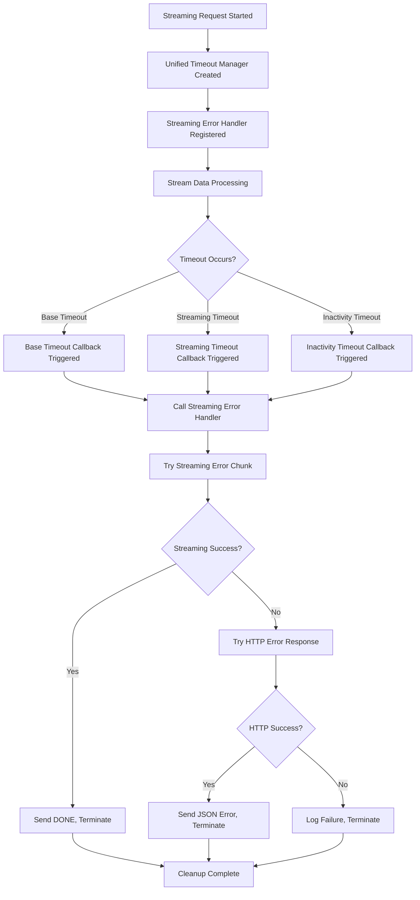

# Timeout Error Handling in Streaming Responses

## Overview

This document describes the enhanced timeout error handling implementation for streaming responses in the qoloba-proxy2 project. The implementation ensures that clients receive proper OpenAI-compliant error messages when timeouts occur during streaming requests.

## Architecture

### Hybrid Error Delivery Approach

The system uses a hybrid approach to deliver timeout errors:

1. **Primary**: Try to send error as streaming chunk (SSE format) if headers already sent
2. **Fallback**: Send HTTP error response if headers not sent or streaming fails
3. **Last Resort**: Proceed with termination even if error delivery fails

### Key Components

#### 1. Timeout Error Utilities (`src/utils/streaming.js`)

- `createTimeoutErrorChunk(requestId, model, message)` - Creates OpenAI-compliant streaming error chunk
- `createTimeoutErrorResponse(requestId, message)` - Creates OpenAI-compliant HTTP error response
- `sendTimeoutErrorStreaming(responseState, model, message)` - Sends error as streaming chunk
- `sendTimeoutErrorHttp(res, requestId, message)` - Sends error as HTTP response
- `handleTimeoutError(responseState, model, reason)` - Main hybrid error handler

#### 2. Enhanced Unified Timeout Manager (`src/utils/unifiedTimeoutManager.js`)

- `registerStreamingErrorHandler(handler)` - Registers callback for streaming timeouts
- `handleStreamingTimeout(reason, responseState, model)` - Handles streaming timeout scenarios
- Enhanced timeout callbacks for base, streaming, and inactivity timeouts

## Error Message Formats

### Streaming Error Chunk (SSE Format)

```json
{
  "id": "chatcmpl-abc123def456",
  "object": "chat.completion.chunk",
  "created": 1234567890,
  "model": "gpt-4.1-mini-2025-04-14",
  "choices": [
    {
      "index": 0,
      "delta": {},
      "finish_reason": "error"
    }
  ],
  "error": {
    "message": "Request timeout",
    "type": "api_error",
    "code": "timeout"
  }
}
```

### HTTP Error Response (JSON Format)

```json
{
  "error": {
    "message": "Request timeout",
    "type": "api_error",
    "code": "timeout",
    "request_id": "request-id"
  }
}
```

## Timeout Types and Messages

| Timeout Type | Message | Scenario |
|--------------|---------|----------|
| `base_timeout` | "Request timeout" | Base request timeout (default 30s) |
| `streaming_timeout` | "Streaming timeout" | Streaming-specific timeout (default 120s) |
| `inactivity_timeout` | "Request timeout due to inactivity" | No data received for configured period (default 60s) |

## Integration Flow



## Usage Examples

### Basic Usage

The timeout error handling is automatically integrated when using streaming responses:

```javascript
import { handleStreamingResponse } from './src/utils/streaming.js'

// The timeout error handling is automatically set up
await handleStreamingResponse(res, req, qolabaClient, qolabaPayload, requestId)
```

### Manual Timeout Error Handling

```javascript
import { handleTimeoutError } from './src/utils/streaming.js'

// Handle timeout error manually
const success = await handleTimeoutError(responseState, model, 'base_timeout')
if (success) {
  console.log('Timeout error sent successfully')
} else {
  console.log('Failed to send timeout error, proceeding with termination')
}
```

## Configuration

Timeout durations can be configured via environment variables:

- `REQUEST_TIMEOUT` - Base timeout (default: 30000ms)
- `STREAMING_TIMEOUT` - Streaming timeout (default: 120000ms) 
- `INACTIVITY_TIMEOUT` - Inactivity timeout (default: 60000ms)

## Error Handling Behavior

### When Headers Already Sent (Streaming in Progress)

1. System attempts to send error as streaming chunk
2

2


2
